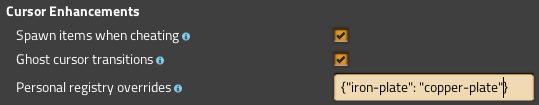

# Cursor Enhancements

Cursor Enhancements is a mod for Factorio that adds new features to the cursor.

[Download on the Mod Portal.](https://mods.factorio.com/mod/CursorEnhancements)

## Features

Cursor Enhancements "enhances" the cursor with these new features:

### Related items scrolling

Using `shift + mousewheel`, you can quickly scroll between related items:

The mod will auto-detect an entity's upgrades and downgrades and automatically set paths for those, but mods can also override these paths. For example, Cursor Enhancements adds various new paths, including one for electric poles and one for inserters:

If you don't have an item and that item places an entity, the ghost cursor will be set. If you are in cheat mode, the mod will simply give you a stack of that item instead.

Other mods can tap Cursor Enhancements' remote interface to add their own overrides. See the [Remote Interface documentation](https://github.com/raiguard/Factorio-CursorEnhancements/wiki/Remote-Interface-Documentation) for instructions.

Additionally, each player can add their own overrides via the mod settings.

### Automatic ghost transitions

If you run out of an item that places an entity, the item will be immediately swapped with the ghost cursor for that entity, and vice versa:

If you are in cheat mode or the map editor, a new stack of items will be spawned into your cursor instead of setting the ghost cursor.

### Recall last item

Hit `Shift + Q` to recall the last item that was in your cursor. If you are out of that item and it places an entity, the ghost cursor will be set. If you are in cheat mode, a stack of that item will be spawned into your cursor instead.

## FAQ

**Q: Why does the camera zoom when I'm scrolling between items?**

A: This is due to the default keybindings for zoom. Go into your controls settings and **unbind** zooming from `shift + mousewheel`. This will fix the problem.

**Q: How do I add my own cursor scrolling overrides?**

A: Go into the per-player mod settings and search for the `Personal registry overrides` option. This option is formatted as a JSON object, with the format `"item-name":  "next-item-name"`. For example, to switch between iron plates and copper plates, you would add `"iron-plate": "copper-plate"` to the object.

